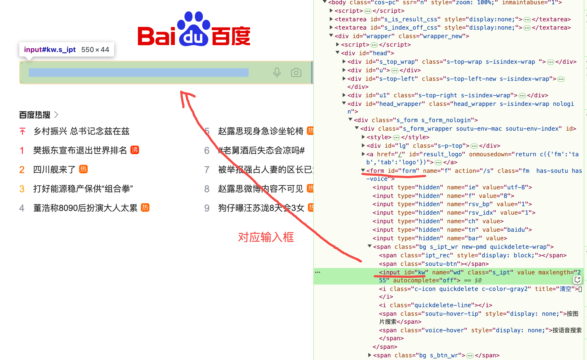
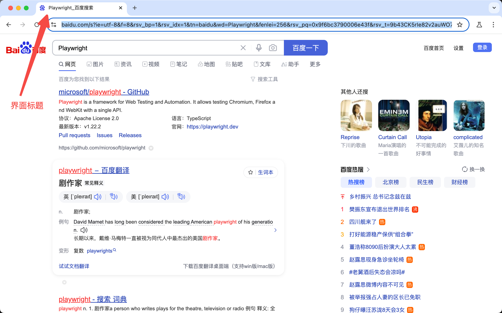
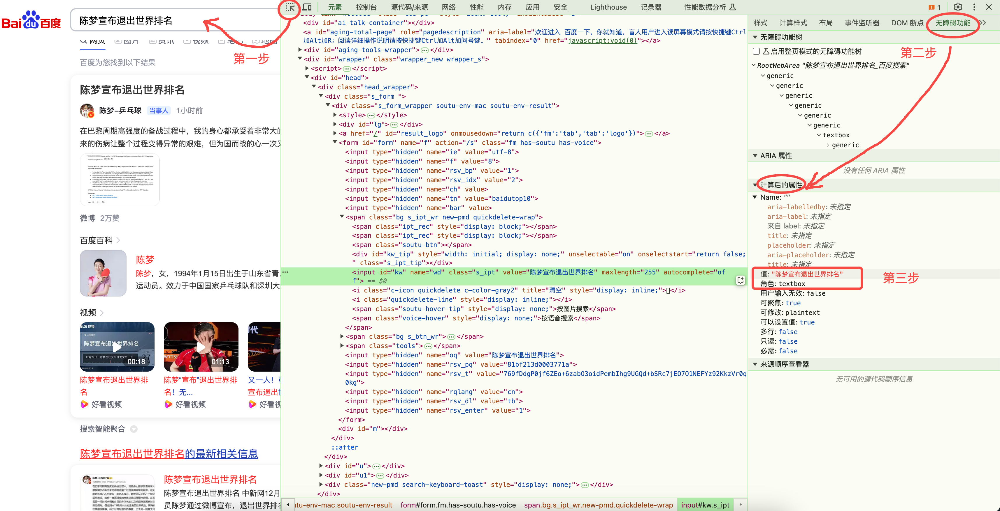

# Selector 选择器定位元素

- [Selector 选择器定位元素](#selector-选择器定位元素)
  - [前言](#前言)
  - [Selector 选择器](#selector-选择器)
  - [CSS 或 XPath 选择器](#css-或-xpath-选择器)
  - [text 文本选择器](#text-文本选择器)
  - [Selector 选择器组合定位](#selector-选择器组合定位)
  - [playwright推荐的内置定位器](#playwright推荐的内置定位器)
  - [get\_by\_role():](#get_by_role)
    - [参数](#参数)
    - [借助浏览器检查工具查看Role:](#借助浏览器检查工具查看role)
    - [name的确定:](#name的确定)
      - [1. aria-label](#1-aria-label)
      - [2. aria-labelledby](#2-aria-labelledby)
      - [3. 元素内容](#3-元素内容)
      - [4. alt（仅适用于 `` 等支持的元素）](#4-alt仅适用于-img-等支持的元素)
      - [5. value（表单控件专属）](#5-value表单控件专属)
      - [6. title属性](#6-title属性)
      - [7. 默认空名称](#7-默认空名称)
    - [role示例及对应 HTML](#role示例及对应-html)
      - [1. button](#1-button)
      - [2. textbox](#2-textbox)
      - [4. heading](#4-heading)
      - [5. link](#5-link)
      - [7. img](#7-img)
      - [8. progressbar](#8-progressbar)


## 前言

Selector 选择器，也就是通常说的元素定位了，页面上点点点的操作，都是基于元素定位，所以这块是重点需要学的核心内容。

## Selector 选择器

说到元素定位，大家肯定会首先想到 selenium 的八大元素定位，其中xpath 和 css才是最主要的。

playwright 可以通过 CSS selector , XPath selector , HTML 属性（比如 id, data-test-id ）或者是 text 文本内容 定位元素。

除了xpath selector外，所有selector默认都是指向shadow DOM，如果要指向常规DOM，可使用 `*:light`，不过通常不需要。

**操作元素，可以先定位再操作:**

```python
page.locator('#kw').fill("playwright")
page.locator('#su').click()
```

**也可以直接调用fill 和 click 方法，传Selector选择器:**

```python
# 一般推荐下面的这种方式
page.fill('#kw', "playwright")
page.click('#su')
```


## CSS 或 XPath 选择器

可以使用 xpath 和 css 元素。

```python
# CSS and XPath
page.fill('css=#kw', "playwright")
page.click('xpath=//*[@id="su"]')
```

或者可以直接写xpath和css语法，不需要前面的前缀 `css=` 和 `xpath=` , **它会自动判断你写的是css还是xpath语法**，前提是你语法没有错误。🚨

```python
page.fill('#kw', "playwright")
page.click('//*[@id="su"]')
```

XPath 和 CSS 选择器可以绑定到 DOM 结构或实现。

当 DOM 结构发生变化时，这些选择器可能会中断。下面的长 CSS 或 XPath 链是导致测试不稳定的 **不良做法示例**:

```python
page.click("#tsf > div:nth-child(2) > div.A8SBwf > div.RNNXgb > div > div.a4bIc > input")
page.click('//*[@id="tsf"]/div[2]/div[1]/div[1]/div/div[2]/input')
```


## text 文本选择器

文本选择器是一个非常实用的定位方式，根据页面上看到的text文本就可以定位了，例如点击百度上的 **"新闻"** 文本:

```python
import asyncio
from playwright.async_api import async_playwright

async def main():
    """
    使用 Playwright 异步 API 打开百度主页，并输出页面标题。
    
    功能描述：
    1. 启动一个 Chromium 浏览器实例。
    2. 创建一个新页面并导航到百度主页。
    3. 点击页面中的 "新闻" 链接。
    4. 最后关闭浏览器。

    注意事项：
    - 浏览器以有界面模式运行 (headless=False)。
    - slow_mo=5000 用于延迟操作，便于观察浏览器行为。
    """
    # 使用 `async_playwright` 进行异步操作
    async with async_playwright() as p:
        # 启动 Chromium 浏览器
        # 参数 `headless=False` 启动有界面模式（即显示浏览器窗口）
        # 参数 `slow_mo=5000` 表示操作之间有 5000 毫秒的延迟，用于演示和调试
        browser = await p.chromium.launch(headless=False, slow_mo=5000)
        
        # 创建一个新的浏览器页面实例
        # 每个页面相当于一个独立的浏览器标签页
        page = await browser.new_page()
        
        # 导航到百度主页，通过指定 URL
        # URL "https://www.baidu.com" 是百度的主页地址
        await page.goto("https://www.baidu.com")
        
        # 获取当前页面的标题
        # 调用 `page.title()` 方法获取页面的标题文本
        # 并将标题打印到控制台
        print(await page.title())
        
        # 点击页面上的 "新闻" 链接
        # 使用 `page.click` 方法通过文本选择器选择元素并点击
        await page.click('text=新闻')
        
        # 关闭浏览器实例以释放资源
        # 调用 `browser.close()` 结束浏览器进程
        await browser.close()

asyncio.run(main())
```


## Selector 选择器组合定位

当查找目标元素，不同的selector可组合使用，用 `>>` 连接。



代码示例:

```python
import asyncio
from playwright.async_api import async_playwright

async def main():
    async with async_playwright() as p:
        # 启动浏览器
        browser = await p.chromium.launch(headless=False, slow_mo=5000)
        # 创建新页面
        page = await browser.new_page()
        # 访问百度首页
        await page.goto('https://www.baidu.com/')
        # 使用组合选择器定位搜索输入框并输入关键词
        await page.locator('form#form >> input#kw').fill('Playwright')
        # 使用组合选择器定位“百度一下”按钮并点击
        await page.locator('form#form >> input#su').click()
        # 等待搜索结果加载
        await page.wait_for_selector('div#content_left')
        # 输出页面标题
        print(await page.title())
        # 关闭浏览器
        await browser.close()

# 运行主函数
asyncio.run(main())
```

终端显示:

```txt
Playwright_百度搜索
```



`>>`的写法如果还不懂，观察下列两种写法就了解了。下列两种写法等价:

```python
# 写法一
await page.locator('form#form >> input#kw').fill('Playwright')
# 写法二
await page.locator('form#form').locator('input#kw').fill('Playwright')
```


## playwright推荐的内置定位器

| 定位器方法               | 描述                                      |
|--------------------------|-------------------------------------------|
| page.get_by_role()       | 通过显式和隐式的可访问性属性定位元素。      |
| page.get_by_text()       | 通过文本内容定位元素。                      |
| page.get_by_label()      | 通过关联标签的文本定位表单控件。            |
| page.get_by_placeholder()| 通过占位符文本定位输入框。                 |
| page.get_by_alt_text()   | 通过文本替代内容定位元素（通常是图片）。     |
| page.get_by_title()      | 通过 title 属性定位元素。                  |
| page.get_by_test_id()    | 通过 data-testid 属性定位元素（也可以配置使用其他属性）。 |

## get_by_role():

`page.get_by_role()` 是 Playwright 提供的一个功能强大的方法，用于通过 [ARIA roles](https://www.w3.org/TR/wai-aria/#roles) 定位页面元素。

ARIA roles 描述了元素的语义用途，这使得 Playwright 能够在更语义化的层面与网页进行交互。通过使用 `get_by_role` 方法，你可以准确地找到具有特定角色的元素，而无需依赖样式或复杂的选择器。

### 参数

- **`role`**: 一个 `Literal` 类型的参数，用于指定 ARIA role，例如 `"button"`、`"checkbox"`、`"textbox"` 等。
- **其他可选参数**:
  - `name`: 一个字符串，用于匹配角色对应的可见名称。
  - `checked`: 一个布尔值，仅适用于 `checkbox` 或 `radio` 等角色，用于匹配是否被选中。
  - `pressed`: 一个布尔值，仅适用于 `button`，用于匹配按钮是否被按下。
  - `expanded`: 一个布尔值，仅适用于 `combobox`、`menu`、`tree` 等角色，用于匹配是否展开。
  - `level`: 一个整数，用于匹配分级结构中的标题级别。
  - `disabled`: 一个布尔值，用于匹配是否为禁用状态。
  - `hidden`: 一个布尔值，指定是否匹配隐藏的元素。

### 借助浏览器检查工具查看Role:

如果你不了解role，可以借助浏览器检查工具的 **无障碍功能 (Accessibility)** 面板的 **计算后的属性** 进行查看。例如:



> 其中"角色"是role，"值"为value。

图中的内容以代码表示:

```python
page.get_by_role("textbox", name="陈梦宣布退出世界排名")
```

如果不了解 `get_by_role` 中 `name` 是如何确定的，可以查看以下内容。

### name的确定:

浏览器会根据以下规则计算 `name`，这是一个从 **高优先级** 到 **低优先级** 的顺序：

#### 1. aria-label

如果元素有显式的 `aria-label` 属性，则其值将作为 `name`。

```html
<button aria-label="提交">按钮</button>
```

**`name`**: `提交`

#### 2. aria-labelledby

如果元素使用 `aria-labelledby` 属性，浏览器会使用 `aria-labelledby` 所引用的其他元素的文本作为 `name`。

```html
<label id="submit-label">提交</label>
<button aria-labelledby="submit-label">按钮</button>
```

**`name`**: `提交`

#### 3. 元素内容

如果元素是某些语义化标签（如 `<button>` 或 `<a>`），并且没有显式的 `aria-label` 或 `aria-labelledby`，则元素的文本内容将成为 `name`。

```html
<button>提交</button>
```

**`name`**: `提交`


#### 4. alt（仅适用于 `` 等支持的元素）

如果是 `` 或其他支持 `alt` 的标签，`alt` 的值会被用作 `name`。

```html

```

**`name`**: `示例图片`

#### 5. value（表单控件专属）

对于表单控件（如 `<input>` 和 `<textarea>`），如果有 value，其值将作为 name。

```html
<input id="kw" name="wd" class="s_ipt" value="陈梦宣布退出世界排名" maxlength="255" autocomplete="off">
```

**`name`**: `陈梦宣布退出世界排名`

#### 6. title属性

如果以上都没有，则会退回使用 `title` 属性作为 `name`。

```html
<button title="提交">按钮</button>
```

**`name`**: `提交`

#### 7. 默认空名称

如果没有以上任何一种来源，`name` 会被视为 **空字符串**。

### role示例及对应 HTML

#### 1. button

匹配按钮元素。

```html
<button>Click Me</button>
<button aria-label="Submit">Submit</button>
```

```python
button = page.get_by_role("button", name="Click Me")
submit_button = page.get_by_role("button", name="Submit")
```

#### 2. textbox

匹配输入框。

```html
<input type="text" aria-label="Username">
```

```python
textbox = page.get_by_role("textbox", name="Username")
```

#### 4. heading

匹配标题，支持级别筛选。

```html
<h1>Main Title</h1>
<h2>Subtitle</h2>
```

```python
main_title = page.get_by_role("heading", name="Main Title", level=1)
subtitle = page.get_by_role("heading", name="Subtitle", level=2)
```

#### 5. link

匹配超链接。

```html
<a href="https://example.com">Visit Example</a>
<a href="https://example.com" aria-label="More Info">More Info</a>
```

```python
link = page.get_by_role("link", name="Visit Example")
info_link = page.get_by_role("link", name="More Info")
```

#### 7. img

匹配图片。

```html

```

```python
image = page.get_by_role("img", name="Sample Image")
```

#### 8. progressbar

匹配进度条。

```html
<div role="progressbar" aria-valuenow="50" aria-valuemin="0" aria-valuemax="100">50%</div>
```

```python
progressbar = page.get_by_role("progressbar", name="50%")
```